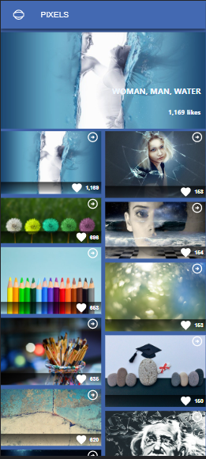
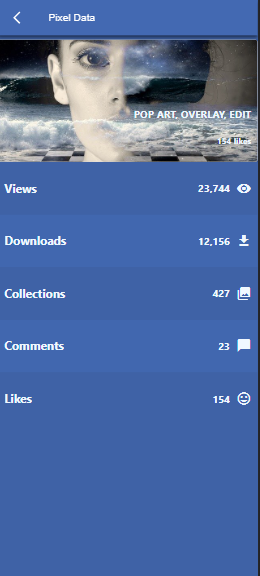

# Pixels

> Pixels home


<table>
  <tr>
    <td>HomePage</td>
     <td>Details Page</td>
  </tr>
  <tr>
    <td></td>
    <td></td>
  
  </tr>
 </table>

A simple web app to show trending photos from [Pixabay](https://pixabay.com/api/docs/), based on likes.

## Built With

- React
- Redux

## Live Demo

[Live Demo Link](https://bavon101-pixel.herokuapp.com/)

## Getting Started

To get a local copy up and running follow these simple example steps.

### Prerequisites

A Web Browser (preferably Google Chrome)

### Setup

- Clone the GitHub Repository
- Go to the Project Directory
- Run ```npm install```
- Run ```npm run build``` to build the project

### Usage

- Run ```npm run start``` to start the live server

## Authors

👤 **Author**

- GitHub: [@Bavon101](https://github.com/Bavon101)
- LinkedIn: [LinkedIn](https://www.linkedin.com/in/akumu-bavon-335416193/)


## 🤝 Contributing

Contributions, issues, and feature requests are welcome!

Feel free to check the [issues page](../../issues/).

## Show your support

Give a ⭐️ if you like this project!

## Acknowledgments

- Microverse
- Original design idea by[ Nelson Sakwa on Behance](https://www.behance.net/sakwadesignstudio).

## 📝 License

This project is [MIT](./LICENSE) licensed.